# 医生简介

> 坐诊时间整理自 `docs/duty` 中的排班表，并按星期列示。实际坐诊安排如有临时调整，请以诊所通知为准。

## 何瑞华｜副主任中医师

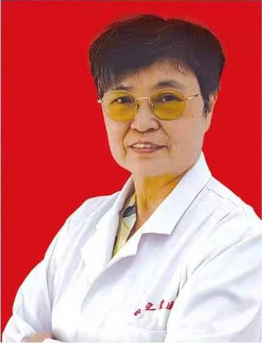

毕业于中医学院，从事内科、妇科临床工作四十余年。擅长诊治肝胆脾胃、消化系统以及心血管、呼吸系统的常见病和多发病，尤其重视妇科疾病的预防、保健和治疗，并运用中医理论开展养生与体质调理。

**坐诊安排**

- 金马诊所：每周一 08:00–11:30。
- 惠民诊所：每周三 08:00–16:30；每周日 08:00–11:30。

## 仲李国｜主治中医师

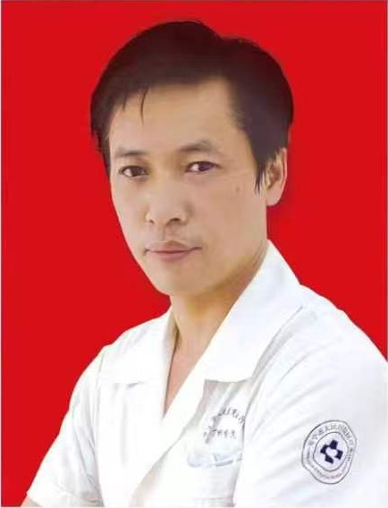

2006 年毕业于北京中医药大学，现于海宁市丁桥镇卫生院中医科工作。擅长运用针灸、推拿和中药治疗颈肩腰腿痛，并开展亚健康调理。

**坐诊安排**

- 惠民诊所：每周一、周六 16:30–20:30。

## 吴振华｜中医师

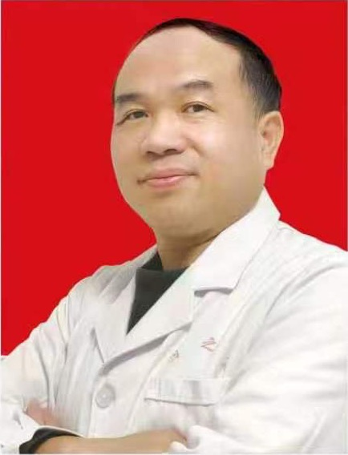

1996 年毕业于嘉兴卫生学校，系统学习过西医与西药，后在浙江中医药大学继续深造，并师从海宁名老中医查益中学习中医内科，为查氏中医第二十世传人。擅长中医内科、妇科常见病诊治及亚健康、养生调理；2023 年起师从王樟连教授学习针灸，注重针药结合，对内科杂病及颈肩腰腿痛的治疗经验较丰富。

**坐诊安排**

- 惠民诊所：每周四 08:00–11:30；每周日 12:30–20:30。
- 四之堂诊所：每周二 16:30–21:00。

## 章杰｜中医师

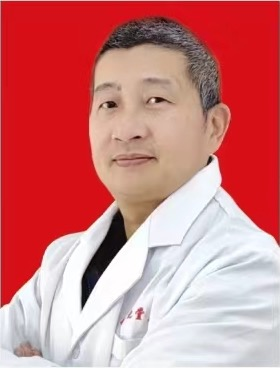

1990 年进入江西中医学院学习，后曾随刘方柏、全世建、刘柏龄等中医专家学习。擅长以中医思维诊治肺、肝、脾、肾及心脑血管疾病，以及妇科、男科、皮肤科疾病、小儿抽动症、强直性脊柱炎、重症肌无力等多发病与疑难重症。

**坐诊安排**

- 惠民诊所：每周二 08:00–20:30。
- 四之堂诊所：每周三、周四 12:30–21:00；每周五 08:00–11:30。

## 吴瑞康｜主治中医师

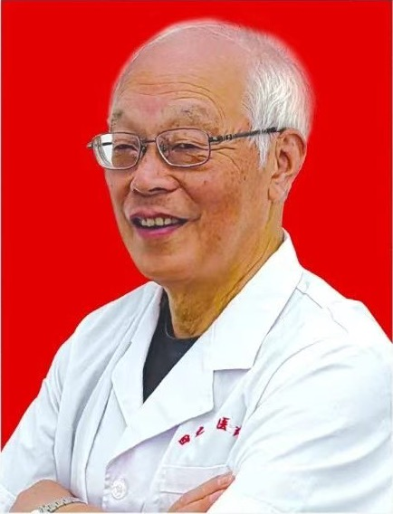

出身中医世家，从医五十余年，长期探索中西医结合诊疗。积累了较丰富的中医妇科、内科临床经验，尤其擅长中医养生和体质调理。

**坐诊安排**

- 金马诊所：每周二 08:00–11:30。
- 惠民诊所：每周六 08:00–16:30。
- 四之堂诊所：每周四 08:00–11:30。

## 沈振华｜全科主治医师

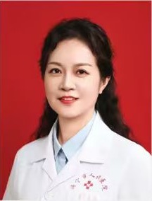

1994 年毕业于杭州医学院妇产科专业，后在浙江大学继续深造全科医学，曾长期在海宁市人民医院妇产科和体检中心工作。擅长妇产科常见病诊治、产后康复、全科常见问题的初步诊疗，以及健康体检报告解读和综合评估。

**坐诊安排**

- 四之堂诊所：每周日 08:00–11:30。

## 王振｜中医师

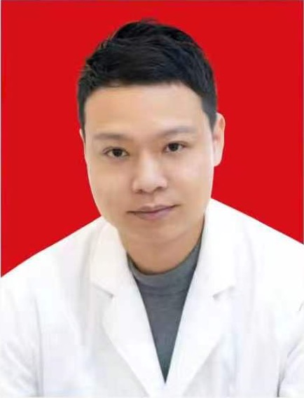

毕业于浙江中医药大学，重视中医辨证论治。擅长中医肿瘤调理，以及癫痫、紫癜、黄褐斑、腰椎间盘突出、颈椎病、静脉曲张、便秘、痛经等疑难杂症的治疗；同时开展慢性病和亚健康调理，对顽固性失眠、慢性湿疹等疾病有针对性的治疗方案。

**坐诊安排**

- 四之堂诊所：隔周一 12:30–21:00。

## 郭廷印｜执业中医师

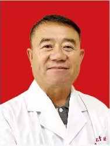

1981 年至 1984 年拜师学习中医，之后在部队学习西医知识，并在吉林市卫生学校中医专业系统学习三年。2011 年至 2024 年开办个体诊所，积累了中医及中西医结合诊疗经验，熟悉内科、外科、妇科、儿科常见病和多发病，尤其擅长颈椎病、腰椎间盘突出、滑膜炎、面瘫、痔疮、带状疱疹和肾结石等疾病的治疗。

**坐诊安排**

- 四之堂诊所：每周二 08:00–16:30；每周三、周四 08:00–21:00；每周一、周五 12:30–21:00。

## 姚彩华｜全科主治医师

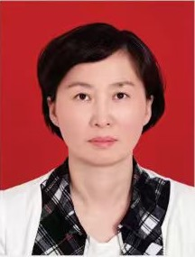

本科学历，拥有 37 年临床经验。擅长妇产科常见病和多发病的诊治，对宫颈疾病、外阴瘙痒及相关病变、阴道炎、月经失调、子宫脱垂和尿失禁等有较丰富的经验。

**坐诊安排**

- 四之堂诊所：每周二 08:00–16:30。

## 沈新培｜主治中医师

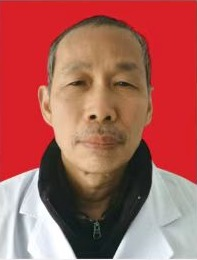

原海宁市第四人民医院住院部主任，临床工作四十余年，曾师从海宁市名中医冯鹤令，并随浙江省立同德医院名中医李安民进修。擅长中医内科、妇科各类杂病，尤其专长于失眠和神经衰弱的诊治。

**坐诊安排**

- 惠民诊所：每周一 08:00–16:30；每周二 08:00–20:30。

## 张观松｜主治医师

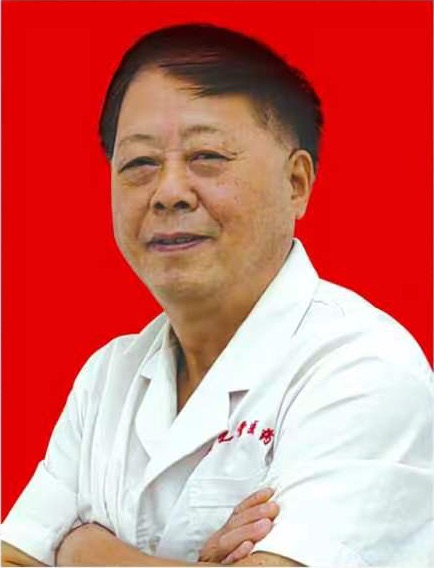

1976 年毕业于浙江医科大学，曾在海宁市第二人民医院工作二十余年，并在上级医院呼吸内科进修。对内科常见病、多发病及疑难杂症具有较丰富的诊治经验。

**坐诊安排**

- 惠民诊所：每周三 16:30–20:30；每周四、周五 08:00–20:30。
- 四之堂诊所：每周六、周日 08:00–21:00。

## 王鸣秋｜中医（专长）医师

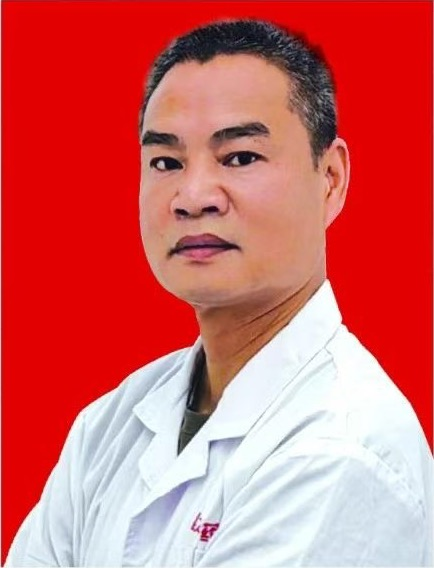

家承中医，自幼接触中医和中草药知识，拥有十余年实践经验。长期在黄湾镇一带服务患者，擅长通过辨证论治和个体化处方治疗风湿痹病及颈、肩、腰、腿痛。

**坐诊安排**

- 惠民诊所：每周五 08:00–16:30。
- 四之堂诊所：每周六 08:00–16:30。

## 赵共识｜执业中医师

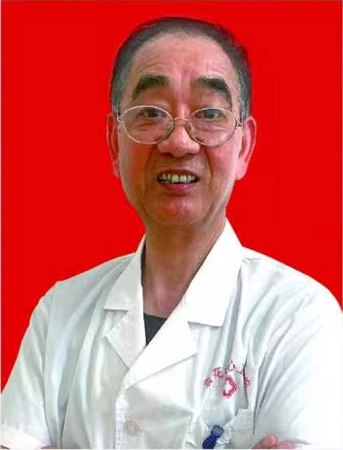

出身中医世家，1975 年进入谈桥卫生院工作，从医四十五年，曾师从海宁名中医蔡鸿宾。临床坚持中医理论与实践结合，并运用中草药个体化处方；擅长中医内科、痹症、跌打损伤及骨关节、神经相关病症，对疑难杂症、体虚、慢性病和亚健康调理也有较丰富的经验。

**坐诊安排**

- 金马诊所：每周三 08:00–11:30。
- 四之堂诊所：每周五、周日 08:00–16:30。

## 沈晓华｜主治中医师

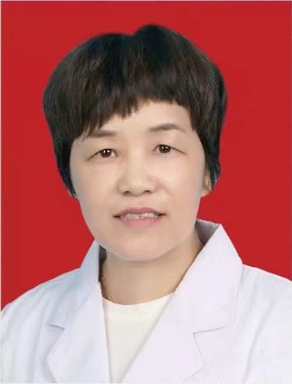

1985 年至 1988 年师从其父、海宁市十佳名医沈良浩学习中医妇科，后接受系统医学和中医药教育。从事中医妇科工作三十五年以上，擅长月经病、带下病、妊娠病、产后病、不孕不育及妇科疑难杂症，尤其在月经不调、不孕不育和宫颈疾病方面经验丰富；曾进修生殖医学与阴道镜技术，并参与科研、发表多篇妇科学术论文。

**坐诊安排**

- 四之堂诊所：每周一、周三 08:00–11:30。
